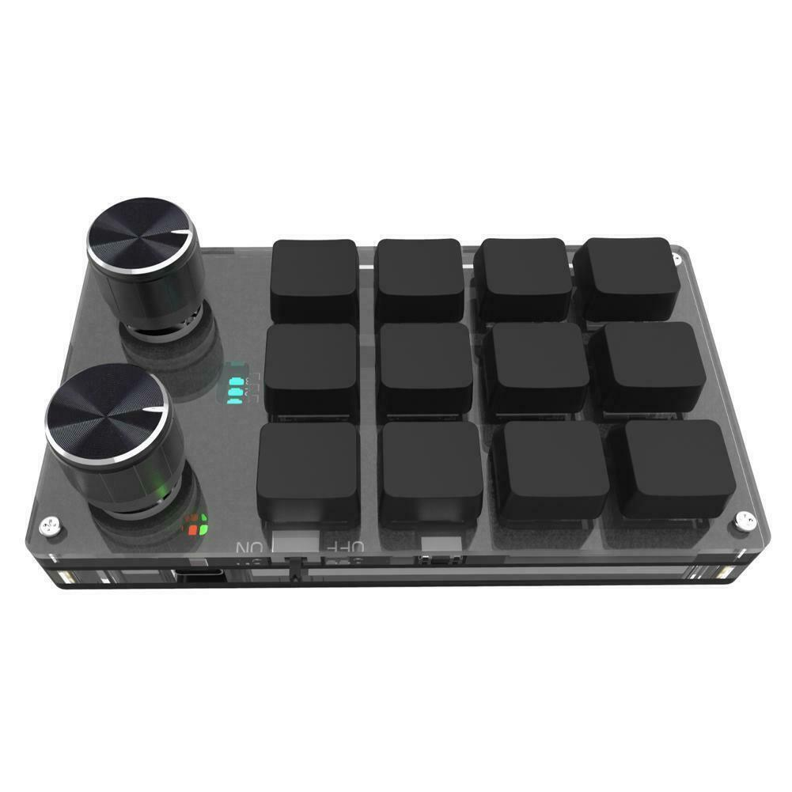

# Macrokeypad / MINI-KeyBoard

Reverse engineered programmer for Chinese macro keyboards.

Recently I bought a Chinese macro keyboard from eBay:

It looks good, works well, but no software was provided in the box and it took me a day to find the software, on some shady google drive link. The program was written in .NET, so I reverse engineered it and uploaded the code to GitHub.

Note: I didn't write the software and to tell the truth it works, but it doesn't provide the best user experience. So, if you have extension ideas, feel free to fork this repo and modify the code and extend this readme for fellow programmers.

## Modells suported

There are a lot of names for this keyboard, but unfortunately no modell number or unique identifier. I collected a few of them, how they sell it on eBay:

* USB Custom Keyboard Volume Button Knob Keypad Mechanical Keyboard
* Keyboard Volume Button Knob Programming USB U2 Macro Bluetooth G9T0
* Custom Keyboard Volume Button Knob Programming Keypad U2 USB Macro K8Y6
* Custom Keyboard Volume Button Knob Programming USB Keypad Bluetooth U2 S5T8
* Custom Keyboard Volume Button Knob Programming Keypad Macro Bluetooth A9Z7
* RGB 6 Key Programming Macro Custom Knob Keyboard Hotswap Game Macropad H0J7
* 16-key Black Keypad Mechanical Keyboard Custom Shortcut Keys Programmable K0E6